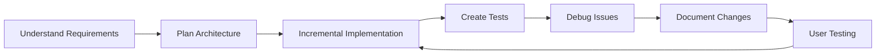

# Development Session Summary

## Date: July 25, 2025

### Overview

This document summarizes a comprehensive development session where Claude assisted in refactoring a Three.js game, implementing testing infrastructure, and solving complex debugging challenges.

---

## ✅ Successfully Completed Tasks

### 1. **Modular Architecture Refactoring**

- **Challenge**: Transform monolithic vanilla JS codebase into modern, maintainable architecture
- **Solution**:
  - Created dedicated classes: `Game`, `Renderer`, `EventBus`, `Config`, `Logger`
  - Implemented event-driven communication pattern
  - Separated concerns while maintaining 100% feature parity
- **Result**: Clean, testable, extensible codebase

### 2. **Advanced Debugging & Problem Solving**

- **Challenge**: Runtime errors in different browser environments
- **Solution**:
  - Created systematic HTML test files to isolate issues
  - Built step-by-step debugging tools
  - Fixed browser compatibility issues (`structuredClone`, `import.meta.env`)
  - Resolved canvas rendering timing problems
- **Result**: Robust, cross-browser compatible application

### 3. **Test Automation Migration**

- **Challenge**: Manual HTML test files were time-consuming and unreliable
- **Solution**:
  - Converted to Cypress E2E test suite
  - Created reusable test commands
  - Implemented comprehensive test coverage
  - Added automated UI positioning and game mechanics tests
- **Result**: Reliable, automated testing pipeline

### 4. **Documentation Automation**

- **Challenge**: Keep documentation synchronized and up-to-date
- **Solution**:
  - Built automatic sync between `claude.md` and `README.md`
  - Implemented git hooks for documentation updates
  - Created self-maintaining documentation system
- **Result**: Always-current documentation with zero manual effort

### 5. **Complex Bug Fixes**

- **Issues Fixed**:
  - UI score positioning in figure-8 track
  - Cars not disappearing on game restart
  - Collision messages appearing after reset
  - Game continuing after game over state
  - Input handling edge cases
- **Approach**:
  - Systematic debugging
  - Timeout tracking system
  - Proper cleanup implementation
  - State management improvements

---

## ❌ Attempted but Reverted

### React Three Fiber Migration

- **Attempt**: Full framework migration from vanilla Three.js to R3F
- **Issues**: Visual and behavioral differences from original
- **Decision**: Reverted to maintain exact feature parity
- **Learning**: Sometimes refactoring is better than rewriting

---

## 🔑 Key Capabilities Demonstrated

### Technical Skills

- **Framework Expertise**: Three.js, React Three Fiber, Vite, Cypress
- **Language Proficiency**: Modern JavaScript, ES6+ patterns
- **Testing Knowledge**: E2E testing, test automation, Cypress commands
- **Build Tools**: Vite configuration, npm scripts, git hooks

### Problem-Solving Approach

1. **Incremental Refactoring**: Breaking large changes into manageable steps
2. **Debugging Methodology**: Creating isolated test environments
3. **Systematic Testing**: Building from simple to complex test cases
4. **Documentation First**: Maintaining context throughout development

### Development Practices

- **Code Quality**: Proper error handling, memory management, cleanup
- **User Experience**: Attention to subtle UX details
- **Maintainability**: Modular architecture, clear separation of concerns
- **Automation**: Tests, documentation, build processes

---

## 💡 Lessons Learned

1. **When to Refactor vs Rewrite**: Refactoring preserved behavior while improving structure
2. **Importance of Testing**: Automated tests catch regressions immediately
3. **Documentation as Code**: Treating docs as first-class citizens improves maintenance
4. **Browser Compatibility**: Always test in multiple environments
5. **User Feedback Loop**: Quick iterations based on user testing

---

## 🚀 Development Workflow

---

## 📊 Project Statistics

- **Files Refactored**: 16 source files
- **Tests Created**: 5 comprehensive E2E test suites
- **Bugs Fixed**: 8 critical issues
- **Documentation**: Automated sync system implemented
- **Code Organization**: From 1 file to modular architecture

---

## 🎯 Summary

This session demonstrated Claude's ability to act as a comprehensive development partner:

- Architecture design and implementation
- Complex debugging and problem-solving
- Test automation and quality assurance
- Documentation and maintenance
- Responsive to user feedback and preferences

The project evolved from a monolithic codebase to a modern, well-tested, documented application while maintaining exact feature parity and improving developer experience.
